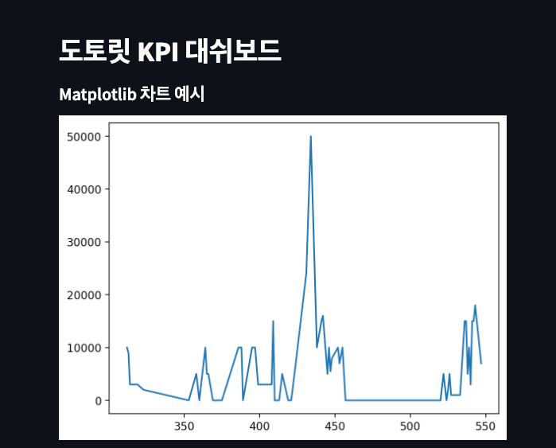

# dangmoog_dashboard

팀 당무지의 KPI지표를 나타내는 간단한 웹사이트입니다.

### Used stacks
- streamlit
  - 파이썬 기반 데이터 표현에 특화된 프론트 프레임워크
- sqlalchemy(pymysql)
  - DB 자료 호출
- matplotlib(plotly)
  - 시각화

## Use in your local environment

```bash
# install dependency
pip install -r requirements.txt
```

```bash
# run streamlit (basic url: http://localhost:8501/)
streamlit run dashboard.py
```

---
### example view
